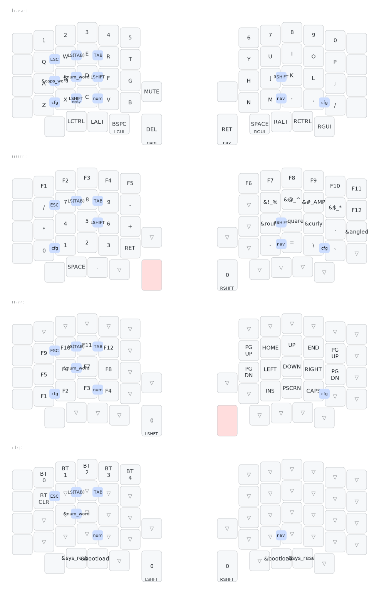

# My Sofle ZMK Config

## Keymap

## Use Cases

### Left handed only

I tend to rest my left hand on my keyboard and right hand on my trackpad/mouse and I use the central side for these:

1. Shortcuts
   - Application switching, copy-pasting, saving, refreshing pages, and other shortcuts that use GUI (Mac) / Ctrl or Alt (Win)
2. Numbers
   - Dates, OTPs, account numbers etc.
   - Primarily activated through held outer thumb key or NAV layer combo
3. Function keys
   - Refreshing, debugging (F7-F10)

The sticky shift combo is useful for any chording that requires shift.

### General typing

The Shift combos on both sides with num word combo are for capitalisation and typing numbers.

### Programming

Programming requires more specific syntax:

1. Brackets
   - These are all on the NUM layer on the right home row for easy access
2. Quotes, && ||, and other symbols
   - These are on the NUM layer on the right side, primarily accessed through holding the left outer thumb key. I may consider reordering them for easier access to the more common symbols
3. Navigating code
   - Navigation is on the NAV layer on the right side, primarily accessed through holding the right outer thumb key
4. ALL CAPS
   - Use cases are constants and SQL statements. Caps word is good for this

### Quick Access

1. CFG layer: top edge combo
2. BASE layer: bottom edge combo

## Other Considerations

- Is a LCTRL and LALT required for Mac? Just use RCTRL and RALT together with right keys for arrow keys/movement.
- Is alt enter the "alternative" enter in Mac? If so, can experiment with tap dance enter = alt enter.
- Change Del to Shift Backspace to free up outer thumb key to be tap numword, hold num layer etc?

## Todo

- Win layer
- Find useful encoder functions (e.g. moving by words).
- Multimeter to fix my left split keys.